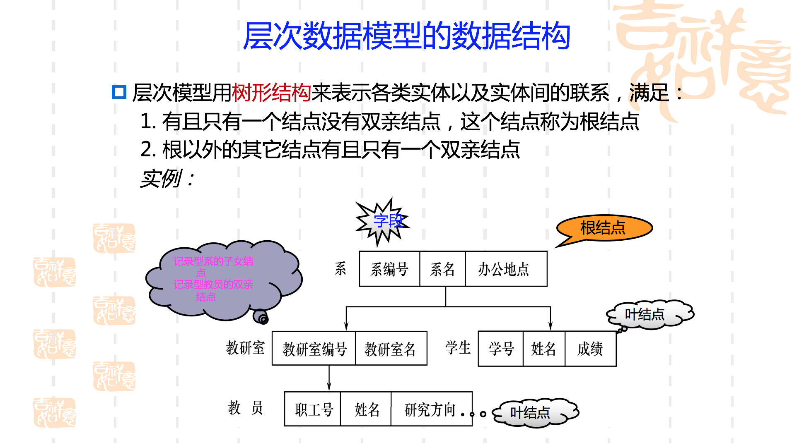
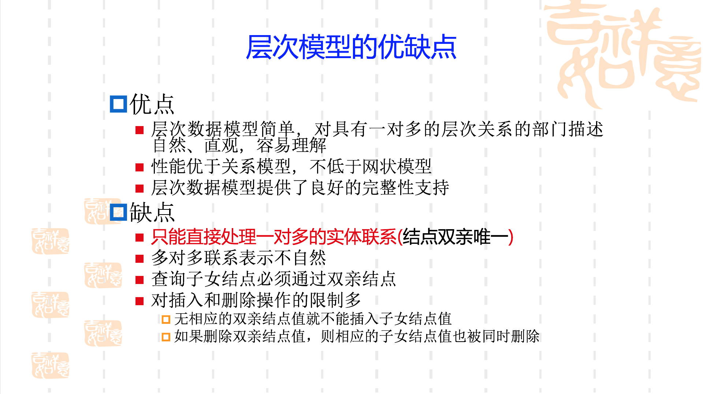
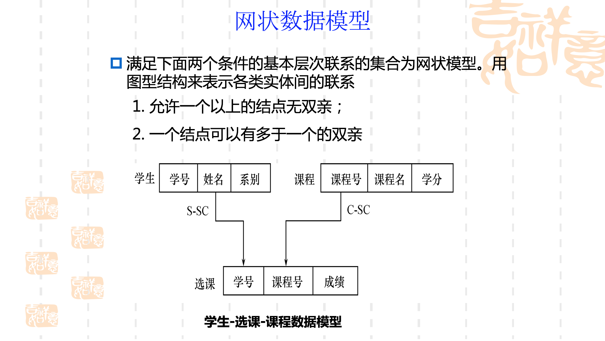
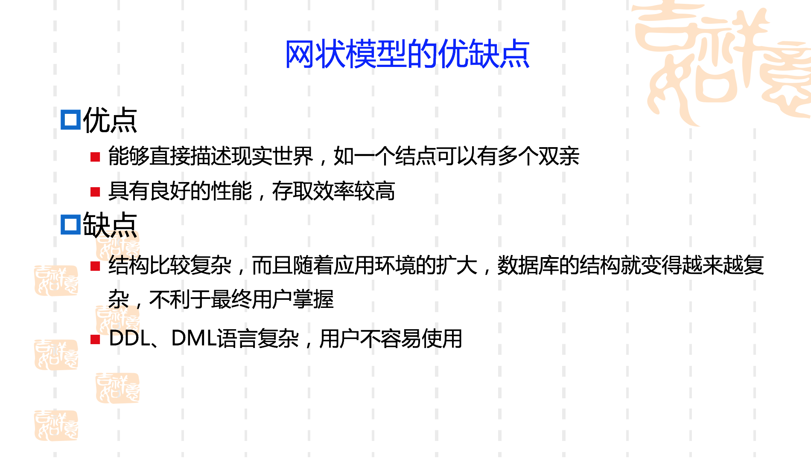
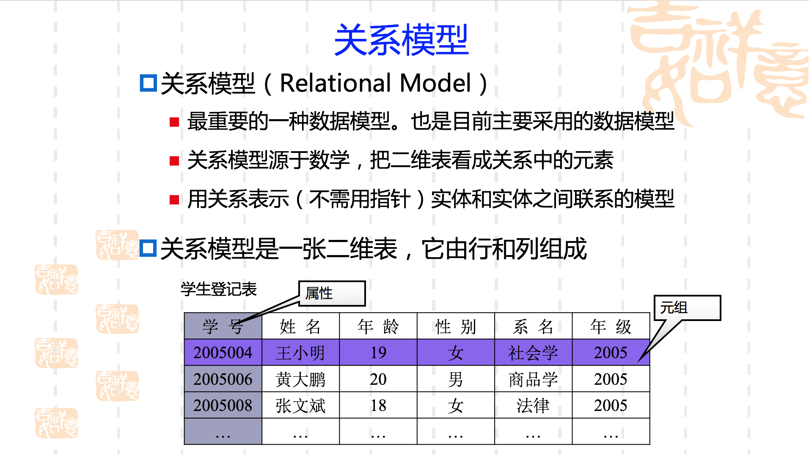
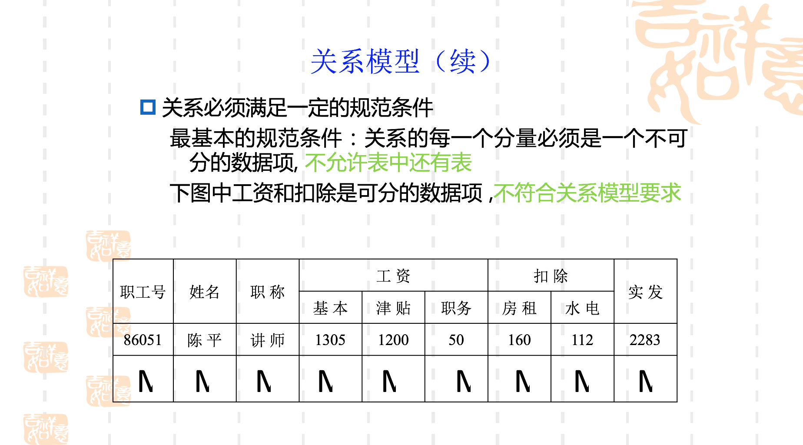

#数据库系统概述
##DataBase数据库
数据库是长期储存在计算机内、有组织的、可共享的大量数据的集合。数据库中的数据按一定的数据模型组织、描述和储存，具有较小的冗余度、较高的数据独立性和易扩展性，并可为各种用户共享。
##DatabBase Management System数据库管理系统
DBMS与操作系统一样是计算机的基础软件

- 数据定义功能 DDL Data Definition Language
- 数据组织、存储和管理
- 数据操纵功能 DML Data Manipylation Language
- 数据库的事物管理和运行管理
- 数据库的建立与维护
- 其他功能

##DataBase System 数据库系统
数据库系统是由数据库、数据库管理系统、应用程序和数据库管理员（DataBase Administrator, DBA)组成的存储、管理、处理和维护数据的系统。

#数据管理技术的产生和发展
##人工管理阶段
- 数据不保存
- 应用程序管理数据
- 数据不共享（数据面向应用程序定义）
- 数据不具有独立性（数据的逻辑结构或者物理结构发生变化后，必须对应用程序做相应修改）

##文件系统阶段
- 数据可以长期保存
- 由文件系统管理数据
- 数据共享性差、冗余度大（数据依然面向应用）
- 数据独立性差（不具有弹性的无整体结构的数据集合）

##数据库系统阶段
- 数据结构化（数据库系统与文件系统的本质区别）
- 数据共享性高、冗余度低且易扩充
- 数据独立性高
   - 物理独立性：用户的应用程序与数据库中数据的物理存储相互独立。当数据的存储位置或存储结构发生变化时，不影响应用程序的特性。
   - 逻辑独立性：用户的应用程序与数据库的逻辑结构相互独立。例如，“学生数据库”中的某张表增加属性列，不会影响原应用程序的执行
- 数据由数据库管理系统统一管理和控制
   - security安全性
   - integrity完整性
   - concurrency并发控制
   - recovery数据库恢复

#数据库发展简史
按照数据模型的进展情况，数据库系统的发展可划分为三代：

- 第一代：层次数据库系统和网状数据库系统
  
  主要支持层次和网状数据模型
- 第二代：关系数据库系统
          
 支持关系数据模型，该模型有严格的理论基础，概念简单、清晰，易于用户理解和使用
- 第三代：新一代数据库系统——面向对象数据库系统
  
   基于扩展的关系数据模型或面向对象数据模型的尚未完全成熟的一代数据库系统 
  
   特点：支持包括数据、对象和知识的管理
   
   产品：Object Store、Ontos、O2、Jasmin等
   
#数据模型（3种）
数据模型是对现实世界数据特征的抽象，是数据库系统的核心和基础
 
现实世界->信息世界->机器世界

##概念模型（信息模型）
* 按用户的观点来对数据和信息建模
* 主要用于数据库设计。
* 不依赖于具体的计算机系统
* 最常用的概念模型是E-R模型

###信息世界的基本概念
- entity实体 
  - 客观存在并可相互区别的事物
- attribute属性
  -  实体所具有的某一特性
- key码 
   - 唯一标识实体的属性集
- entity type实体型 
  - 用实体名及属性名集合来抽象和刻画同类实体
 例如学生（学号，姓名，性别，出生年月，院系）就是一个实体型
- entity set实体集 
  - 同一类型实体的集合称为实体集，全体学生就是一个实体集
- relationship联系 
 - 实体内部的联系：各属性之间的联系
 - 实体之间的联系：不同实体集之间的联系
          - (1)  一对一联系（1：1）   系——系主任
          - (2)  一对多联系（1：n）   班级——学生
         -  (3)  多对多联系（m：n）   课程——学生

###概念模型的表示方法（Entity-Relationship approach实体-联系方法）即（E-R diagram）E-R图

##逻辑模型

- 数据库中不仅要存放数据本身，还要存放数据间的联系
- 可用不同的方法表示数据之间的联系
- 表示数据之间联系的方法称为逻辑（数据）模型
- 按计算机系统的观点对数据建模
- 主要用于DBMS的实现
- 有网状、层次、关系、面向对象等

- 非关系模型
  -  层次模型（Hierarchical Model）
  - 网状模型(Network Model )
- 关系模型(Relational Model)  
  - 数据结构：表
- 面向对象模型(Object Oriented Model）
  - 数据结构：对象

###层次模型

###网状模型

网状模型与层次模型的区别

* 网状模型允许多个结点没有双亲结点
* 网状模型允许结点有多个双亲结点
* 网状模型允许两个结点之间有多种联系（复合联系）
* 网状模型可以更直接地去描述现实世界
* 层次模型实际上是网状模型的一个特例

###关系模型

- 关系（Relation）
一个关系对应一张表
- 元组（Tuple）
表中的一行即为一个元组
- 属性（Attribute）
   表中的一列即为一个属性，给每一个属性起一个名称即属性名
- 主码（Key）
表中的某(组)属性，它可以唯一确定一个元组。
- 域（Domain）
属性的取值范围

关系模型的优缺点

- 优点
 - 建立在严格的数学概念的基础上
 - 概念单一
 - 实体和各类联系都用关系来表示
 - 对数据的检索结果也是关系
 - 关系模型的存取路径对用户透明
 - 具有更高的数据独立性，更好的安全保密性
 - 简化了程序员的工作和数据库开发建立的工作
- 缺点
 - 查询效率往往不如非关系数据模型

##物理模型
- 反映数据的存储结构

#数据库系统的结构
三级模式结构，是数据库系统内部的系统结构

##数据库系统模式的概念
- “型”type 对某一类数据的结构和属性的说明
- 值value 值是型的一个具体赋值
- 模式schema 数据库中全体数据的逻辑结构和特征的描述，是所有用户的公共数据视图，它仅仅涉及型的描述，不涉及具体的值。
- 实例instance 模式的一个具体值

###数据库系统的三级模式结构
- 模式 
- 外模式external schema 外模式也称子模式或用户模式，它是数据库用户（包括应用程序员和最终用户）能够看见和使用的局部数据的逻辑结构和特征的描述，是数据库用户的数据视图，始于某一应用有关的数据的逻辑表示。外模式通常是模式的子集。
- 内模式internal schema内模式也称存储模式storage schema，一个数据库只有一个内模式。它是数据物理结构和存储方式的描述，是数据在数据库内部的组织方式。

###数据库的二级映像功能与数据独立性
- 外模式/模式映像（逻辑独立性）
- 模式/内模式映像（物理独立性）
-

